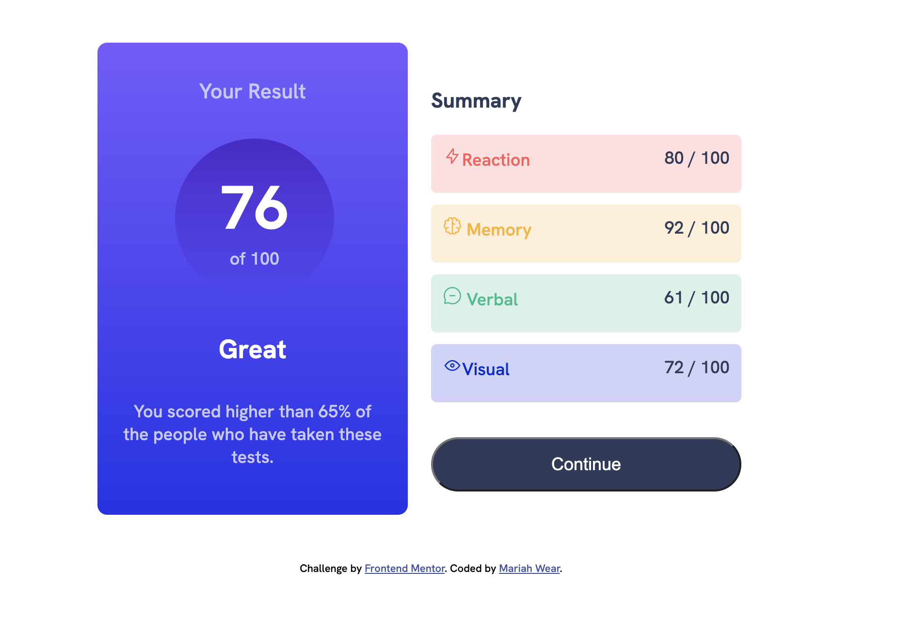

# Results summary component solution

This is a solution to the [Results summary component challenge on Frontend Mentor](https://www.frontendmentor.io/challenges/results-summary-component-CE_K6s0maV). Frontend Mentor challenges help you improve your coding skills by building realistic projects. 

## Table of contents

- [Overview](#overview)
  - [The challenge](#the-challenge)
  - [Screenshot](#screenshot)
  - [Links](#links)
- [My process](#my-process)
  - [Built with](#built-with)
  - [What I learned](#what-i-learned)
  - [Continued development](#continued-development)
  - [Useful resources](#useful-resources)
- [Author](#author)

## Overview

### The challenge

Users should be able to:

- View the optimal layout for the interface depending on their device's screen size
- See hover and focus states for all interactive elements on the page

### Screenshot

### Links

- Solution URL: [Github Repo](https://github.com/mariahw4/results-summary)
- Live Site URL: [Github Pages](https://mariahw4.github.io/results-summary/)

## My process

### Built with

- Semantic HTML5 markup
- CSS custom properties
- Flexbox
- Mobile-first workflow

### What I learned

This project was a great opportunity to fine tune and expand my knowledge of CSS.  I feel that I struggled a lot to manipulate the components into the proper format and learned a lot along the way.  

I utilized root variables for colors for the first time and found this to be a streamlined and confusion free method to use the same colors throughout the application. 

### Continued development

In order to continue development of this app I would utilize the data.json file to allow for dynamic adjustments to the values within the application.  

### Useful resources

- [CSS Flexbox](https://css-tricks.com/snippets/css/a-guide-to-flexbox/) - This helped me with layout. I like the presentation and the examples were easy to follow. 

## Author

- Website - [Mariah Wear](https://mariahw4.github.io/02-professional-portfolio/)
- Frontend Mentor - [@mariahw4](https://www.frontendmentor.io/profile/mariahw4)
- LinkedIn - [Mariah Wear](https://www.linkedin.com/in/mariah-wear-7b1630255/)
